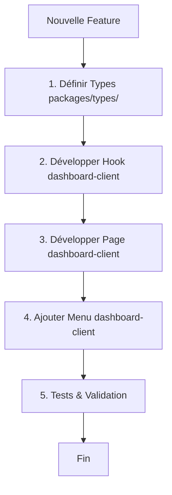

# Workflow Développement Quelyos Suite

## Principe Fondamental

**RÈGLE D'OR** : Dashboard-client (ERP Complet) est la **SOURCE DE VÉRITÉ** pour toutes les fonctionnalités.

Les packages partagés (`@quelyos/*`) centralisent les types et la logique réutilisable.

---

## Architecture Types

### Package `@quelyos/types` — Single Source of Truth

```
packages/types/src/
├── support.ts        ✅ Types Support/Helpdesk
├── finance.ts        ⏳ Types Finance
├── marketing.ts      ⏳ Types Marketing
├── crm.ts            ⏳ Types CRM
├── stock.ts          ⏳ Types Stock
├── hr.ts             ⏳ Types RH
├── pos.ts            ⏳ Types Point de Vente
└── index.ts          (exports centralisés)
```

**Utilisation** :
```typescript
// ✅ BON - Import depuis package centralisé
import type { Ticket, TicketState, CreateTicketData } from '@quelyos/types'

// ❌ MAUVAIS - Import local (divergence garantie)
import type { Ticket } from '@/types/support'
```

---

## Checklist Développement Nouvelle Feature

### Étape 1 : Définir Types (packages/types/)

**TOUJOURS commencer par définir les types dans `packages/types/src/[module].ts`**

```typescript
// packages/types/src/support.ts

/**
 * CRITICAL: Single Source of Truth pour types support
 * Utilisé par: dashboard-client + super-admin-client + futurs frontends
 */

export type TicketState = 'new' | 'open' | 'pending' | 'resolved' | 'closed' | 'cancelled'

export interface Ticket {
  id: number
  reference: string
  subject: string
  state: TicketState
  // ... tous les champs
}

export interface CreateTicketData {
  subject: string
  description: string
  // ... payload création
}
```

**Checklist** :
- [ ] Types créés dans `packages/types/src/[module].ts`
- [ ] JSDoc complet (usage, apps concernées)
- [ ] Build package : `cd packages/types && pnpm build`
- [ ] Commit types AVANT implémentation hook/page

---

### Étape 2 : Développer Hook (dashboard-client)

**Développer la logique métier dans `dashboard-client/src/hooks/`**

```typescript
// dashboard-client/src/hooks/useTickets.ts
import { useQuery, useMutation } from '@tanstack/react-query'
import { fetchApi } from '@/lib/api-base'
import type { Ticket, CreateTicketData, TicketFilters } from '@quelyos/types'

export function useTickets(filters?: TicketFilters) {
  return useQuery({
    queryKey: ['tickets', filters],
    queryFn: () => fetchApi<Ticket[]>('/api/support/tickets', { params: filters })
  })
}

export function useCreateTicket() {
  return useMutation({
    mutationFn: (data: CreateTicketData) => fetchApi('/api/support/tickets', {
      method: 'POST',
      body: data
    })
  })
}
```

**Checklist** :
- [ ] Types importés de `@quelyos/types`
- [ ] React Query (useQuery/useMutation)
- [ ] Gestion erreurs
- [ ] Cache invalidation

---

### Étape 3 : Développer Page (dashboard-client)

**Créer la page dans `dashboard-client/src/pages/[module]/`**

**Lire OBLIGATOIREMENT** : `dashboard-client/.claude/UI_PATTERNS.md`

```tsx
/**
 * Page de gestion des tickets support
 *
 * Fonctionnalités :
 * - Liste des tickets avec filtres
 * - Création nouveau ticket
 * - Mise à jour état
 * - Assignation agent
 * - Historique conversations
 */

import { Layout } from '@/components/Layout'
import { Breadcrumbs, PageNotice, Button } from '@/components/common'
import { useTickets } from '@/hooks/useTickets'
import type { Ticket } from '@quelyos/types'

export function TicketsPage() {
  const { data, isLoading, error } = useTickets()

  if (error) {
    return <div role="alert">Erreur: {error.message}</div>
  }

  if (isLoading) {
    return <SkeletonTable />
  }

  return (
    <Layout>
      <Breadcrumbs items={[...]} />
      <PageNotice notices={supportNotices} />

      <div className="flex justify-between items-center mb-6">
        <h1 className="text-2xl font-semibold text-gray-900 dark:text-white">
          Tickets Support
        </h1>
        <Button href="/support/tickets/new">
          Nouveau Ticket
        </Button>
      </div>

      <TicketTable tickets={data} />
    </Layout>
  )
}
```

**Checklist** :
- [ ] JSDoc en en-tête (5+ fonctionnalités)
- [ ] Layout + Breadcrumbs + PageNotice
- [ ] Error state + Loading state
- [ ] Dark mode (`dark:` classes)
- [ ] Imports `lucide-react` (pas heroicons)

---

### Étape 4 : Ajouter au Menu (dashboard-client)

**Ajouter la route dans `dashboard-client/src/config/modules.ts`**

```typescript
{
  id: 'support',
  name: 'Support',
  basePath: '/support',
  icon: Headphones,
  sections: [
    {
      title: 'Tickets',
      items: [
        { name: 'Tous les Tickets', path: '/support/tickets', icon: Ticket },
        { name: 'Nouveau Ticket', path: '/support/tickets/new', icon: Plus },
      ]
    }
  ]
}
```

**Checklist** :
- [ ] Route en anglais (`/support/tickets`)
- [ ] Label en français (`'Tickets'`)
- [ ] Icône `lucide-react`
- [ ] Test navigation : `pnpm dev` → menu visible

---

### Étape 5 : Vérification Finale

**Tests et validation**

```bash
# Build dashboard-client
cd dashboard-client && pnpm build

# Tests si disponibles
pnpm test

# Vérifier pas de régression
pnpm dev
```

**Checklist** :
- [ ] Build sans erreur
- [ ] Page accessible et fonctionnelle
- [ ] Navigation menu OK
- [ ] API calls fonctionnels
- [ ] Dark mode compatible

---

## Règles Types Centralisés

### ✅ Quand Utiliser `@quelyos/types`

**TOUJOURS** pour :
- Entités métier (Ticket, Invoice, Product, Customer, etc.)
- Enums/States (TicketState, OrderStatus, PaymentMethod, etc.)
- Payloads API (CreateTicketData, UpdateInvoiceRequest, etc.)
- Filtres/Queries (TicketFilters, ProductSearchParams, etc.)

### ❌ Quand NE PAS Utiliser `@quelyos/types`

**Excepté** pour :
- Types UI locaux (composant spécifique)
- Props React (si non réutilisables)
- Types utilitaires locaux (si non partagés)

---

## Résumé Workflow



**Durée estimée** : 2-3h par feature complète (types + hook + page + menu)

---

## Checklist Globale

### Avant Commit
- [ ] Types centralisés (`@quelyos/types`)
- [ ] Build réussi dashboard-client
- [ ] Dark/Light mode vérifié
- [ ] ESLint clean
- [ ] Navigation menu fonctionnelle

### Avant PR
- [ ] Documentation JSDoc complète
- [ ] Notices ajoutées (`lib/notices`)
- [ ] Tests manuels (dev mode)
- [ ] Vérification cohérence UI/UX

---

## Références

- [UI_PATTERNS.md](../dashboard-client/.claude/UI_PATTERNS.md) — Patterns pages dashboard
- [API_CONVENTIONS.md](./API_CONVENTIONS.md) — Conventions API backend
- [ROUTING_CONVENTIONS.md](./ROUTING_CONVENTIONS.md) — Conventions routing (anglais)
- [CLAUDE.md](../CLAUDE.md) — Instructions principales

---

**Version** : 2.0 - 2026-01-31
