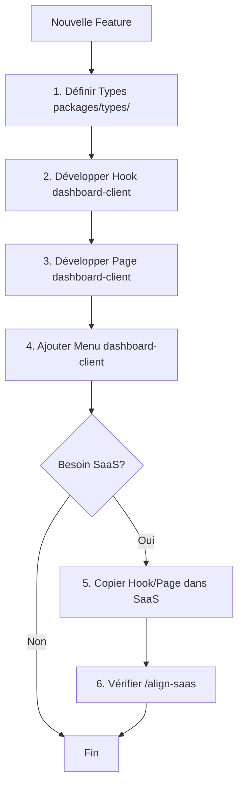

# Workflow Développement Quelyos Suite

## Principe Fondamental

**RÈGLE D'OR** : Dashboard-client (ERP Complet) est la **SOURCE DE VÉRITÉ** pour toutes les fonctionnalités.

Les packages partagés (`@quelyos/*`) centralisent les types et la logique réutilisable.

---

## Architecture Types

### Package `@quelyos/types` — Single Source of Truth

```
packages/types/src/
├── support.ts        ✅ COMPLET (migré)
├── finance.ts        ⏳ TODO
├── marketing.ts      ⏳ TODO
├── crm.ts            ⏳ TODO
├── stock.ts          ⏳ TODO
├── hr.ts             ⏳ TODO
├── pos.ts            ⏳ TODO
└── index.ts          (exports centralisés)
```

**Utilisation** :
```typescript
// ✅ BON - Import depuis package centralisé
import type { Ticket, TicketState, CreateTicketData } from '@quelyos/types'

// ❌ MAUVAIS - Import local (divergence garantie)
import type { Ticket } from '@/types/support'
```

**Vérification tsconfig** :
```json
{
  "compilerOptions": {
    "paths": {
      "@quelyos/types": ["../../packages/types"]  // ✅ BON
      // "@quelyos/types": ["./src/types"]         // ❌ MAUVAIS
    }
  }
}
```

---

## Checklist Développement Nouvelle Feature

### Étape 1 : Définir Types (packages/types/)

**TOUJOURS commencer par définir les types dans `packages/types/src/[module].ts`**

```typescript
// packages/types/src/support.ts

/**
 * CRITICAL: Single Source of Truth pour types support
 * Utilisé par: dashboard-client + super-admin-client + futurs frontends
 */

export type TicketState = 'new' | 'open' | 'pending' | 'resolved' | 'closed' | 'cancelled'

export interface Ticket {
  id: number
  reference: string
  subject: string
  state: TicketState
  // ... tous les champs
}

export interface CreateTicketData {
  subject: string
  description: string
  // ... payload création
}
```

**Checklist** :
- [ ] Types créés dans `packages/types/src/[module].ts`
- [ ] JSDoc complet (usage, apps concernées)
- [ ] Build package : `cd packages/types && pnpm build`
- [ ] Commit types AVANT implémentation hook/page

---

### Étape 2 : Développer Hook (dashboard-client)

**Développer la logique métier dans `dashboard-client/src/hooks/`**

```typescript
// dashboard-client/src/hooks/useTickets.ts
import { useQuery, useMutation } from '@tanstack/react-query'
import { fetchApi } from '@/lib/api-base'
import type { Ticket, CreateTicketData, TicketFilters } from '@quelyos/types'  // ✅ Import package

export function useTickets(filters?: TicketFilters) {
  return useQuery({
    queryKey: ['tickets', filters],
    queryFn: async () => {
      const qs = buildQueryString(filters)
      return fetchApi<{ success: boolean; tickets: Ticket[]; total: number }>(
        `/api/tickets${qs}`,
        { method: 'GET', credentials: 'include' }
      )
    },
  })
}

export function useCreateTicket() {
  const queryClient = useQueryClient()

  return useMutation({
    mutationFn: async (data: CreateTicketData) => {
      return fetchApi<{ success: boolean; ticket: Ticket }>(
        '/api/tickets',
        {
          method: 'POST',
          headers: { 'Content-Type': 'application/json' },
          body: JSON.stringify(data),
        }
      )
    },
    onSuccess: () => {
      queryClient.invalidateQueries({ queryKey: ['tickets'] })
    },
  })
}
```

**Checklist** :
- [ ] Hook créé dans `dashboard-client/src/hooks/`
- [ ] Imports types depuis `@quelyos/types` uniquement
- [ ] Logique métier complète (CRUD, filtres, pagination)
- [ ] Invalidation cache react-query
- [ ] Test hook en dev : `pnpm dev:dashboard`

---

### Étape 3 : Développer Page (dashboard-client)

**Créer l'UI dans `dashboard-client/src/pages/[module]/`**

```tsx
// dashboard-client/src/pages/support/Tickets.tsx
/**
 * Page Liste des Tickets Support
 *
 * Fonctionnalités:
 * - Liste tickets avec filtres (état, priorité, catégorie)
 * - Recherche full-text
 * - Pagination
 * - Export CSV
 * - Création ticket via modal
 *
 * @module Support
 */

import { useState } from 'react'
import { Layout } from '@/components/Layout'
import { Breadcrumbs, PageNotice, Button, SkeletonTable } from '@/components/common'
import { supportNotices } from '@/lib/notices'
import { useTickets } from '@/hooks/useTickets'
import type { Ticket, TicketState, TicketPriority } from '@quelyos/types'  // ✅
import { Search, Plus, Download } from 'lucide-react'  // ✅ lucide-react (jamais heroicons)

export default function Tickets() {
  const [filters, setFilters] = useState({ state: '', priority: '', search: '' })
  const { data, isLoading, error } = useTickets(filters)

  if (error) {
    return (
      <Layout>
        <Breadcrumbs items={[{ label: 'Support' }, { label: 'Tickets' }]} />
        <div role="alert" className="text-red-600 dark:text-red-400">
          Erreur chargement tickets
        </div>
      </Layout>
    )
  }

  if (isLoading) {
    return (
      <Layout>
        <Breadcrumbs items={[{ label: 'Support' }, { label: 'Tickets' }]} />
        <SkeletonTable rows={10} cols={6} />
      </Layout>
    )
  }

  return (
    <Layout>
      <Breadcrumbs items={[{ label: 'Support' }, { label: 'Tickets' }]} />

      <header className="flex justify-between items-center mb-6">
        <h1 className="text-2xl font-bold text-gray-900 dark:text-white">
          Tickets Support ({data?.total || 0})
        </h1>
        <div className="flex gap-2">
          <Button variant="secondary" leftIcon={<Download className="w-4 h-4" />}>
            Exporter CSV
          </Button>
          <Button leftIcon={<Plus className="w-4 h-4" />}>
            Nouveau Ticket
          </Button>
        </div>
      </header>

      <PageNotice notices={supportNotices} page="tickets" />

      {/* Filtres + Table + Pagination */}
      {/* ... */}
    </Layout>
  )
}
```

**Checklist** :
- [ ] JSDoc en en-tête (5+ fonctionnalités)
- [ ] `<Layout>` wrapper
- [ ] `<Breadcrumbs>` en premier
- [ ] Header avec `<Button>` (jamais `<button>` ou `<Link>` stylé)
- [ ] `<PageNotice>` après header
- [ ] Error state avec `role="alert"`
- [ ] Loading state avec `SkeletonTable`
- [ ] Icônes `lucide-react` (JAMAIS heroicons)
- [ ] Dual mode dark/light vérifié automatiquement
- [ ] Build test : `pnpm build --filter=quelyos-backoffice`

---

### Étape 4 : Ajouter au Menu (dashboard-client)

**Enregistrer la page dans `dashboard-client/src/config/modules.ts`**

```typescript
// dashboard-client/src/config/modules.ts
import { LifeBuoy } from 'lucide-react'

export const modules = [
  // ... autres modules
  {
    id: 'support',  // ✅ anglais
    name: 'Support',  // ✅ français
    path: '/support',  // ✅ anglais
    icon: LifeBuoy,
    subMenu: [
      {
        id: 'support-tickets',
        name: 'Tickets',
        path: '/support/tickets',  // ✅ route anglais
        // ... config
      },
    ],
  },
]
```

**Checklist** :
- [ ] Route en anglais (`/support/tickets`)
- [ ] Label en français (`'Tickets'`)
- [ ] Icône `lucide-react`
- [ ] Test navigation : `pnpm dev:dashboard` → menu visible

---

### Étape 5 : Vérification Finale

**Tests et validation**

```bash
# Build dashboard-client
cd dashboard-client && pnpm build

# Tests si disponibles
pnpm test

# Vérifier pas de régression
pnpm dev
```

**Checklist** :
- [ ] Build sans erreur
- [ ] Page accessible et fonctionnelle
- [ ] Navigation menu OK
- [ ] API calls fonctionnels
- [ ] Dark mode compatible

---

## Règles Types Centralisés

### ✅ Quand Utiliser `@quelyos/types`

**TOUJOURS** pour :
- Entités métier (Ticket, Invoice, Product, Customer, etc.)
- Enums/States (TicketState, OrderStatus, PaymentMethod, etc.)
- Payloads API (CreateTicketData, UpdateInvoiceRequest, etc.)
- Filtres/Queries (TicketFilters, ProductSearchParams, etc.)

### ❌ Quand NE PAS Utiliser `@quelyos/types`

**Excepté** pour :
- Types UI locaux (composant spécifique)
- Props React (si non réutilisables)
- Types utilitaires locaux (si non partagés)

---

## Règles Hooks

### ✅ Hooks Locaux (Acceptés)

**Chaque app peut avoir sa propre implémentation de hook** SI :
- Logique métier spécifique au SaaS
- État management différent (useState vs react-query)
- API endpoints différents

**MAIS** :
- Types importés de `@quelyos/types` (contrat API identique)
- Signature hook cohérente (noms paramètres/retour)

**Exemple acceptable** :
```typescript
// dashboard-client/src/hooks/useTickets.ts
import type { Ticket, TicketFilters } from '@quelyos/types'  // ✅
export function useTickets(filters?: TicketFilters) {
  return useQuery({ ... })  // react-query
}

// apps/support-os/src/hooks/useTickets.ts
import type { Ticket, TicketFilters } from '@quelyos/types'  // ✅ Même types
export function useTickets(filters?: TicketFilters) {
  const [tickets, setTickets] = useState<Ticket[]>([])  // useState (différent)
  // ... logique spécifique SaaS
  return { tickets, isLoading, error }
}
```

### ⚠️ Duplication Hooks (À Éviter)

**Si code IDENTIQUE** :
- Créer `packages/business-hooks/` (futur)
- OU documenter duplication justifiée
- OU utiliser hook ERP dans SaaS (si aucune adaptation)

---

## Gestion Divergences Légitimes

### Cas 1 : Feature Spécifique SaaS

**Si feature existe UNIQUEMENT dans SaaS** :
- OK d'avoir page/hook dans SaaS uniquement
- Types DOIVENT être dans `@quelyos/types` (futur réutilisation ERP)
- Documenter dans JSDoc : `@saas-specific support-os`

**Exemple** :
```typescript
// packages/types/src/support.ts
/**
 * Dashboard support stats (SaaS support-os specific)
 * @saas-specific support-os
 */
export interface SupportDashboardStats {
  totalTickets: number
  openTickets: number
  avgResponseTime: number
}
```

### Cas 2 : Variante UI SaaS

**Si UI différente mais même données** :
- Types identiques (`@quelyos/types`)
- Hook identique (logique API)
- Page différente (présentation SaaS)

**Exemple** :
```tsx
// dashboard-client : Table complète
<TicketTable tickets={data.tickets} />

// apps/support-os : Cards simplifiées
<TicketCards tickets={data.tickets} />
```

---

## Utilisation `/align-saas`

### Commande

```bash
# Vérifier tous les SaaS
/align-saas

# Vérifier un SaaS spécifique
/align-saas support-os

# Appliquer corrections auto
/align-saas --fix
```

### Interprétation Output

#### ❌ ERREUR CRITIQUE
```
❌ ERREUR: Divergence types
   → TicketState: 5 états (dashboard) vs 6 états (support-os)
```
**Action** : Migrer types vers `@quelyos/types` immédiatement

#### ⚠️ ATTENTION
```
⚠️  ATTENTION: Duplication code
   → useTickets.ts: 208 lignes identiques
```
**Action** : Vérifier si duplication justifiée ou créer hook partagé

#### ℹ️ INFO
```
ℹ️  INFO: Page manquante dans dashboard
   → apps/support-os/src/pages/support/Dashboard.tsx
```
**Action** : Copier vers dashboard si pertinent pour ERP complet

---

## Résumé Workflow



**Durée estimée** : 2-4h par feature complète (types + hook + page + SaaS)

---

## Checklist Globale

### Avant Commit
- [ ] Types centralisés (`@quelyos/types`)
- [ ] Build réussi dashboard-client
- [ ] Build réussi SaaS concernés
- [ ] `/align-saas` : 0 erreur critique
- [ ] Dark/Light mode vérifié
- [ ] ESLint clean

### Avant PR
- [ ] Documentation JSDoc complète
- [ ] Notices ajoutées (`lib/notices`)
- [ ] Tests manuels (dev mode)
- [ ] `/align-saas` : alignement > 85%

---

## Références

- [UI_PATTERNS.md](../dashboard-client/.claude/UI_PATTERNS.md) — Patterns pages dashboard
- [API_CONVENTIONS.md](./API_CONVENTIONS.md) — Conventions API backend
- [ROUTING_CONVENTIONS.md](./ROUTING_CONVENTIONS.md) — Conventions routing (anglais)
- [CLAUDE.md](../CLAUDE.md) — Instructions principales
