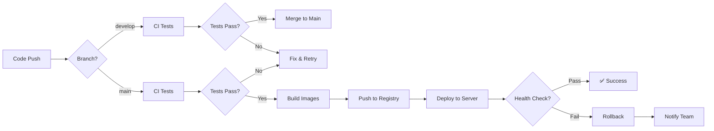

# Guide CI/CD - Quelyos ERP

## 📋 Vue d'ensemble

Le projet utilise **GitHub Actions** pour l'intégration continue (CI) et le déploiement continu (CD).

## 🔄 Workflows

### 1. CI - Tests & Quality Checks (`ci.yml`)

**Déclenchement**: Push ou Pull Request vers `main` ou `develop`

**Jobs**:

#### a. Frontend Linting & Type Checking
- ✅ ESLint
- ✅ TypeScript type checking
- **Durée**: ~2 minutes

#### b. Frontend Unit Tests
- ✅ Jest tests avec couverture de code
- ✅ Upload vers Codecov
- **Seuil de couverture**: 70%
- **Durée**: ~3 minutes

#### c. Frontend E2E Tests
- ✅ Playwright tests (Chromium uniquement en CI)
- ✅ Upload des rapports
- **Durée**: ~5 minutes

#### d. Frontend Production Build
- ✅ Build Next.js production
- ✅ Vérification de la taille du bundle
- **Durée**: ~4 minutes

#### e. Backend Tests (Odoo)
- ✅ Tests unitaires Odoo
- ✅ Tests API
- **Note**: Nécessite PostgreSQL service
- **Durée**: ~6 minutes

#### f. Security Scanning
- ✅ Trivy vulnerability scanner
- ✅ Upload vers GitHub Security
- **Durée**: ~2 minutes

#### g. Docker Build Test
- ✅ Build test des images Docker
- ✅ Validation docker-compose.prod.yml
- **Durée**: ~5 minutes

**Durée totale**: ~25-30 minutes (parallèle)

---

### 2. CD - Deploy to Production (`cd.yml`)

**Déclenchement**:
- Push vers `main`
- Tags `v*.*.*` (ex: v1.0.0)
- Déclenchement manuel (workflow_dispatch)

**Jobs**:

#### a. Build and Push Docker Images
1. Build image frontend (multi-stage)
2. Push vers GitHub Container Registry
3. Tag backend Odoo officiel
4. **Output**: URLs des images

#### b. Deploy to Server
1. Copie des fichiers de configuration
2. Pull des nouvelles images
3. Stop des anciens containers
4. Start des nouveaux containers
5. Health checks
6. Notification de succès/échec

**Variables requises**:
```bash
# Secrets GitHub
SSH_PRIVATE_KEY         # Clé SSH pour accès serveur
SERVER_HOST            # IP ou domaine du serveur
SERVER_USER            # Utilisateur SSH (ex: root, ubuntu)
PRODUCTION_URL         # URL de production (ex: quelyos.com)
```

#### c. Rollback (manuel)
- Retour à la version précédente
- Déclenchement manuel uniquement

---

### 3. Scheduled Jobs (`cron-jobs.yml`)

**Déclenchement**: Tous les jours à 2h UTC (ou manuel)

**Jobs**:

#### a. Database Backup
- ✅ Backup PostgreSQL quotidien
- ✅ Rétention: 7 jours
- ✅ Upload S3 (optionnel)
- **Durée**: ~5 minutes

#### b. Check Updates
- ✅ npm outdated
- ✅ npm audit
- ✅ Rapport dans GitHub Summary
- **Durée**: ~2 minutes

#### c. Lighthouse Performance Audit
- ✅ Audit homepage & pages clés
- ✅ Scores Performance, SEO, Accessibility
- ✅ Upload des rapports
- **Durée**: ~3 minutes

#### d. Cleanup Docker Images
- ✅ Suppression images > 7 jours
- ✅ Nettoyage volumes inutilisés
- ✅ Rapport espace disque
- **Durée**: ~1 minute

---

### 4. Dependabot (`dependabot.yml`)

**Mise à jour automatique des dépendances**:

- ✅ **NPM** (frontend): Hebdomadaire (lundi 9h)
- ✅ **Pip** (backend): Hebdomadaire (lundi 9h)
- ✅ **GitHub Actions**: Hebdomadaire (lundi 9h)
- ✅ **Docker**: Hebdomadaire (lundi 9h)

**Configuration**:
- Max 10 PRs ouvertes simultanément
- Labels automatiques
- Ignore des updates majeures pour React/Next.js

---

## 🔐 Configuration des Secrets

### GitHub Secrets (Settings > Secrets and variables > Actions)

**Obligatoires pour CD**:
```bash
SSH_PRIVATE_KEY         # Clé privée SSH pour connexion serveur
SERVER_HOST            # example.com ou 192.168.1.100
SERVER_USER            # ubuntu, root, etc.
PRODUCTION_URL         # quelyos.com
```

**Optionnels**:
```bash
AWS_ACCESS_KEY_ID      # Pour backup S3
AWS_SECRET_ACCESS_KEY  # Pour backup S3
ODOO_URL              # Override pour tests
SITE_URL              # Override pour tests
CODECOV_TOKEN         # Pour Codecov coverage
```

### Générer une clé SSH pour le déploiement

```bash
# Sur votre machine locale
ssh-keygen -t ed25519 -C "github-actions" -f ~/.ssh/github-actions

# Copier la clé publique sur le serveur
ssh-copy-id -i ~/.ssh/github-actions.pub user@server

# Copier la clé privée dans GitHub Secrets
cat ~/.ssh/github-actions
# Copier le contenu dans SSH_PRIVATE_KEY
```

---

## 🚀 Utilisation

### Déploiement automatique

**Push vers main**:
```bash
git checkout main
git pull origin main
git merge develop
git push origin main
# → Déclenche automatiquement build + deploy
```

**Créer un tag de version**:
```bash
git tag -a v1.0.0 -m "Version 1.0.0"
git push origin v1.0.0
# → Déclenche build + deploy avec version tag
```

### Déploiement manuel

1. Aller sur GitHub → Actions
2. Sélectionner "CD - Deploy to Production"
3. Cliquer "Run workflow"
4. Choisir l'environnement (production/staging)
5. Cliquer "Run workflow"

### Rollback

1. Aller sur GitHub → Actions
2. Sélectionner "CD - Deploy to Production"
3. Cliquer "Run workflow"
4. Cocher "Rollback"
5. Cliquer "Run workflow"

---

## 📊 Monitoring & Rapports

### Voir les résultats des tests

1. **GitHub Actions tab**:
   - Vue d'ensemble des workflows
   - Logs détaillés de chaque job
   - Artifacts téléchargeables

2. **Pull Request checks**:
   - Statut des tests en bas de la PR
   - Détails en cliquant sur "Details"

3. **Codecov**:
   - Couverture de code frontend
   - Rapport de tendance
   - URL: https://codecov.io/gh/VOTRE-ORG/QuelyosERP

### Rapports disponibles

#### Tests E2E (Playwright)
- **Localisation**: Artifacts → playwright-report
- **Contenu**: Screenshots, traces, vidéos des échecs

#### Lighthouse Audit
- **Localisation**: Artifacts → lighthouse-report
- **Contenu**: Scores performance, SEO, accessibility

#### Couverture de code (Jest)
- **Localisation**: Artifacts → coverage
- **Contenu**: Rapport HTML lcov

---

## 🔧 Configuration Serveur

### Prérequis serveur

```bash
# Installation Docker & Docker Compose
curl -fsSL https://get.docker.com -o get-docker.sh
sh get-docker.sh

# Installation Docker Compose v2
sudo apt-get update
sudo apt-get install docker-compose-plugin

# Créer dossier projet
mkdir -p ~/quelyos
cd ~/quelyos
```

### Structure serveur

```
~/quelyos/
├── docker-compose.prod.yml
├── .env.production
├── nginx/
│   └── nginx.conf
├── backups/               # Créé automatiquement
└── logs/                  # Créé automatiquement
```

### Permissions

```bash
# Ajouter l'utilisateur au groupe docker
sudo usermod -aG docker $USER
newgrp docker

# Permissions sur les dossiers
chmod 755 ~/quelyos
chmod 600 ~/quelyos/.env.production
```

---

## 🐛 Troubleshooting

### Erreur: "Permission denied (publickey)"

**Cause**: Clé SSH invalide ou non configurée

**Solution**:
```bash
# Vérifier la connexion SSH
ssh user@server

# Vérifier le secret GitHub
# Settings > Secrets > SSH_PRIVATE_KEY

# Regénérer la clé si nécessaire
ssh-keygen -t ed25519 -C "github-actions" -f ~/.ssh/github-actions
```

### Erreur: "Docker daemon not running"

**Solution**:
```bash
# Sur le serveur
sudo systemctl start docker
sudo systemctl enable docker
```

### Erreur: "Tests fail in CI but pass locally"

**Causes possibles**:
1. Dépendances non synchronisées
2. Variables d'environnement manquantes
3. Timeouts trop courts

**Solution**:
```bash
# Nettoyer et réinstaller
rm -rf node_modules package-lock.json
npm install

# Vérifier les env vars dans .github/workflows/ci.yml
```

### Erreur: "Health check failed"

**Cause**: Services non démarrés après déploiement

**Solution**:
```bash
# SSH sur le serveur
ssh user@server

# Vérifier les logs
cd ~/quelyos
docker-compose -f docker-compose.prod.yml logs --tail=100

# Redémarrer si nécessaire
docker-compose -f docker-compose.prod.yml restart
```

---

## 📈 Métriques

### Objectifs CI/CD

- ✅ **Build time**: <10 minutes
- ✅ **Test coverage**: >70%
- ✅ **Deployment time**: <5 minutes
- ✅ **Zero-downtime deployment**: Oui (via health checks)
- ✅ **Automated rollback**: Oui

### KPIs

| Métrique | Cible | Actuel |
|----------|-------|--------|
| CI Success Rate | >95% | - |
| Deployment Success Rate | >98% | - |
| Mean Time to Recovery (MTTR) | <10 min | - |
| Test Execution Time | <30 min | ~25 min |
| Deployment Frequency | Daily | - |

---

## 🔄 Workflow Complet



---

## 📚 Ressources

- [GitHub Actions Documentation](https://docs.github.com/en/actions)
- [Docker Compose Documentation](https://docs.docker.com/compose/)
- [Dependabot Documentation](https://docs.github.com/en/code-security/dependabot)
- [Playwright CI](https://playwright.dev/docs/ci)
- [Jest CI](https://jestjs.io/docs/cli#--ci)

---

## 📝 Changelog

| Date | Version | Changements |
|------|---------|-------------|
| 2026-01-22 | 1.0.0 | Configuration initiale CI/CD |

---

**Maintenu par**: Quelyos Team
